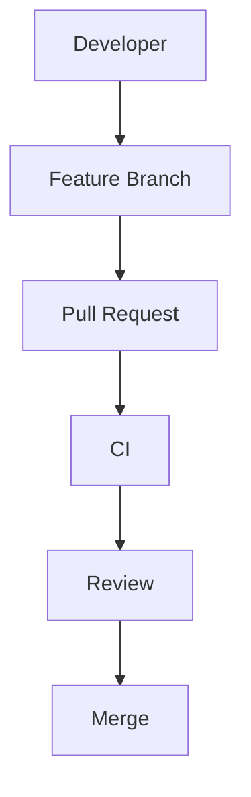

# Markdown: 

## Table of Contents

1.  [What Markdown Is](#1-what-markdown-is)
2.  [How Markdown Works](#2-how-markdown-works)
3.  [Your First Markdown File](#3-your-first-markdown-file)
4.  [Headings](#4-headings)
5.  [Paragraphs and Line Breaks](#5-paragraphs-and-line-breaks)
6.  [Emphasis](#6-emphasis)
7.  [Lists](#7-lists)
8.  [Links](#8-links)
9.  [Images](#9-images)
10. [Code](#10-code)
11. [Blockquotes](#11-blockquotes)
12. [Horizontal Rules](#12-horizontal-rules)
13. [Tables](#13-tables)
14. [Escaping Markdown](#14-escaping-markdown)
15. [HTML Inside Markdown](#15-html-inside-markdown)
16. [Task Lists](#16-task-lists)
17. [Anchors and Table of Contents](#17-anchors-and-table-of-contents)
18. [Footnotes](#18-footnotes)
19. [Extended Markdown and
    Portability](#19-extended-markdown-and-portability)
20. [GitHub-Flavored Markdown](#20-github-flavored-markdown)
21. [README Files](#21-readme-files)
22. [Software Documentation](#22-software-documentation)
23. [Projects and Portfolios](#23-projects-and-portfolios)
24. [Study Notes](#24-study-notes)
25. [Technical Specifications](#25-technical-specifications)
26. [API Documentation](#26-api-documentation)
27. [Changelogs](#27-changelogs)
28. [Issues and Pull Requests](#28-issues-and-pull-requests)
29. [Professional Documentation
    Structure](#29-professional-documentation-structure)
30. [Writing Good Markdown](#30-writing-good-markdown)
31. [Common Mistakes](#31-common-mistakes)
32. [Troubleshooting Rendering](#32-troubleshooting-rendering)
33. [Markdown Editors and Preview](#33-markdown-editors-and-preview)
34. [Markdown and Git](#34-markdown-and-git)
35. [Markdown and Other Formats](#35-markdown-and-other-formats)
36. [Advanced Patterns](#36-advanced-patterns)
37. [Docs-as-Code Workflows](#37-docs-as-code-workflows)
38. [Complete Syntax Cheat Sheet](#38-complete-syntax-cheat-sheet)
39. [Professional Checklist](#39-professional-checklist)
40. [Final Mental Model](#40-final-mental-model)

------------------------------------------------------------------------

# 1. What Markdown Is

Markdown is a lightweight markup language for writing structured text
using plain characters. A Markdown file is normally stored as `.md` or
`.markdown`.

Example:

``` markdown
# My Project

This is **important**.

- First item
- Second item

[Visit GitHub](https://github.com)
```

Markdown is popular because it is readable as source text, easy to
version with Git, portable, and useful for technical documentation.

------------------------------------------------------------------------

# 2. How Markdown Works

The basic pipeline is:

``` text
Markdown source -> Markdown parser -> rendered document
```

For example:

``` markdown
# Hello
```

may become an HTML heading equivalent to:

``` html
<h1>Hello</h1>
```

There is not one perfectly identical Markdown implementation. Common
standards and extensions include CommonMark and GitHub-Flavored Markdown
(GFM). Documentation platforms may add their own features.

**Professional rule:** know which renderer will consume your Markdown
before relying on non-standard features.

------------------------------------------------------------------------

# 3. Your First Markdown File

Create `README.md`:

``` markdown
# My Project

This is my first Markdown document.

## Features

- Easy to write
- Easy to read
- Works well with Git
```

Open it in a Markdown preview or on a platform such as GitHub.

------------------------------------------------------------------------

# 4. Headings

Use `#` characters:

``` markdown
# Heading 1
## Heading 2
### Heading 3
#### Heading 4
##### Heading 5
###### Heading 6
```

A professional hierarchy might be:

``` markdown
# Project Documentation

## Installation

### Windows
### macOS
### Linux

## Configuration
## Usage
## Troubleshooting
```

Use headings to describe document structure, not just to make text look
large.

------------------------------------------------------------------------

# 5. Paragraphs and Line Breaks

Separate paragraphs with a blank line:

``` markdown
This is paragraph one.

This is paragraph two.
```

A single newline may be rendered as a soft line break depending on the
implementation.

For a hard line break, many implementations support two trailing spaces
or a backslash:

``` markdown
Line one.  
Line two.
```

``` markdown
Line one.\
Line two.
```

Prefer normal paragraphs unless a hard break has semantic value.

------------------------------------------------------------------------

# 6. Emphasis

Italic:

``` markdown
*italic*
_italic_
```

Bold:

``` markdown
**bold**
__bold__
```

Bold + italic:

``` markdown
***bold and italic***
```

GitHub-style strikethrough:

``` markdown
~~removed~~
```

Use emphasis for meaning, not decoration. For example:

``` markdown
**Warning:** Never commit production credentials.
```

------------------------------------------------------------------------

# 7. Lists

## Unordered

``` markdown
- Apple
- Banana
- Orange
```

## Nested

``` markdown
- Frontend
  - HTML
  - CSS
  - JavaScript
- Backend
  - Python
  - Java
```

## Ordered

``` markdown
1. Install Git
2. Clone the repository
3. Create a branch
4. Make changes
5. Commit
```

Lists are ideal for steps, features, requirements, and concise
collections.

------------------------------------------------------------------------

# 8. Links

Basic link:

``` markdown
[GitHub](https://github.com)
```

Link with title:

``` markdown
[GitHub](https://github.com "GitHub homepage")
```

Email:

``` markdown
[Email](mailto:example@example.com)
```

Reference-style link:

``` markdown
Read the [Git documentation][git-docs].

[git-docs]: https://git-scm.com/doc
```

Reference links are useful when a document contains many links or
repeated destinations.

------------------------------------------------------------------------

# 9. Images

``` markdown

```

The text inside `[]` is alternative text. Use meaningful alt text for
accessibility and for cases where the image cannot load.

Remote images are possible:

``` markdown

```

For important project assets, repository-local images are often more
reproducible than external image URLs.

------------------------------------------------------------------------

# 10. Code

## Inline code

``` markdown
Run `git status` before committing.
```

Use inline code for commands, filenames, variables, functions, and short
technical terms.

## Fenced code blocks

```` markdown
```python
print("Hello, world!")
```
````

The language identifier enables syntax highlighting when supported.

Common identifiers include:

``` text
python javascript typescript java c cpp csharp go rust bash powershell sql json yaml html css markdown plaintext
```

## Terminal examples

Keep commands separate from expected output:

```` markdown
Run:

```bash
git status
```

Expected output may look like:

```text
On branch main
nothing to commit, working tree clean
```
````

This makes it clear what the reader should type versus what the tool may
return.

------------------------------------------------------------------------

# 11. Blockquotes

``` markdown
> This is a quotation.
```

Notes and warnings are often written as:

``` markdown
> **Note:** This command changes the database.
```

``` markdown
> **Warning:** Do not run this against production without approval.
```

Nested quotes:

``` markdown
> Outer quote
>
> > Nested quote
```

------------------------------------------------------------------------

# 12. Horizontal Rules

Common syntax:

``` markdown
---
```

Other forms include `***` and `___`.

Use horizontal rules for genuine thematic breaks, not between every
section.

------------------------------------------------------------------------

# 13. Tables

Basic table:

``` markdown
| Command | Purpose |
|---|---|
| `git status` | Show repository state |
| `git log` | Show commit history |
| `git diff` | Show changes |
```

Alignment:

``` markdown
| Left | Center | Right |
|:---|:---:|---:|
| A | B | C |
| D | E | F |
```

Use tables for structured comparisons and reference data. Avoid using
them for long paragraphs or multi-step procedures.

------------------------------------------------------------------------

# 14. Escaping Markdown

Prefix a Markdown-significant character with a backslash when you want
it shown literally.

``` markdown
\*not italic\*
\# not a heading
\[not a link\]
```

Common characters that may need escaping include `\`, `` ` ``, `*`, `_`,
`{}`, `[]`, `()`, `#`, `+`, `-`, `.`, `!`, `|`, and `>` depending on
context.

------------------------------------------------------------------------

# 15. HTML Inside Markdown

Many implementations allow HTML:

``` html
<p>This is HTML inside Markdown.</p>
```

Some platforms support collapsible sections:

``` html
<details>
<summary>Show advanced information</summary>

Advanced content.

</details>
```

Support varies. For portable documents, prefer standard Markdown where
possible.

------------------------------------------------------------------------

# 16. Task Lists

GitHub-style task lists:

``` markdown
- [ ] Write documentation
- [ ] Add tests
- [x] Create repository
```

Useful for issue checklists, release preparation, project plans, and
study notes.

------------------------------------------------------------------------

# 17. Anchors and Table of Contents

Many renderers generate anchors from headings. A common internal link
is:

``` markdown
[Go to Installation](#installation)
```

A long document can start with:

``` markdown
## Table of Contents

- [Installation](#installation)
- [Configuration](#configuration)
- [Usage](#usage)
- [Troubleshooting](#troubleshooting)
```

Anchor generation rules differ slightly across platforms, so test
important links in the target renderer.

------------------------------------------------------------------------

# 18. Footnotes

Some Markdown implementations support footnotes:

``` markdown
This statement has a note.[^1]

[^1]: Additional information.
```

Use footnotes for supporting context or references, not information that
the reader needs to understand the main procedure.

------------------------------------------------------------------------

# 19. Extended Markdown and Portability

Some features are extensions rather than universal Markdown:

-   definition lists
-   footnotes
-   mathematical expressions
-   Mermaid diagrams
-   raw HTML
-   collapsible sections
-   custom attributes
-   platform-specific alerts

The important rule is:

> Markdown is a family of implementations, not a promise that every
> renderer supports every feature.

If portability matters, use widely supported syntax and test the
rendered document in the destination platform.

------------------------------------------------------------------------

# 20. GitHub-Flavored Markdown

GitHub-Flavored Markdown (GFM) adds or supports features useful for
software projects, including:

-   tables
-   task lists
-   strikethrough
-   fenced code blocks with language identifiers
-   automatic link handling
-   GitHub-specific rendering behavior

Example:

``` markdown
~~old approach~~
```

Result:

~~old approach~~

Always distinguish Markdown syntax that is broadly portable from
GitHub-specific behavior when writing reusable documentation.

------------------------------------------------------------------------

# 21. README Files

`README.md` is often the first document someone reads in a software
repository.

A strong README may contain:

``` text
Project name
Description
Features
Requirements
Installation
Configuration
Usage
Examples
Testing
Project structure
Contributing
License
```

Example:

``` markdown
# Task Manager API

A REST API for managing tasks.

## Features

- User authentication
- Task creation
- Task updates
- Task deletion

## Installation

```bash
git clone https://github.com/example/task-manager.git
cd task-manager
```

## Running

``` bash
python app.py
```

## Testing

``` bash
pytest
```


    The exact structure should match the project rather than becoming a template filled with irrelevant sections.

    ---

    # 22. Software Documentation

    Technical documentation should answer:

    ```text
    What is it?
    Why does it exist?
    Who is it for?
    How do I install it?
    How do I configure it?
    How do I use it?
    What can go wrong?
    How do I troubleshoot it?
    Where can I learn more?

A useful structure is:

``` markdown
# Authentication Service

## Overview
## Prerequisites
## Installation
## Configuration
## Usage
## API
## Troubleshooting
## Security Considerations
```

------------------------------------------------------------------------

# 23. Projects and Portfolios

Markdown can make a software project understandable to someone who did
not build it.

Example structure:

``` markdown
# E-Commerce Platform

## Overview

A full-stack e-commerce application.

## Technologies

- React
- Node.js
- PostgreSQL
- Docker

## Architecture


## Features

- User authentication
- Product catalog
- Shopping cart
- Payments

## Future Improvements

- [ ] Add analytics
- [ ] Improve search
- [ ] Add recommendations
```

A portfolio README should demonstrate both what was built and how it
works.

------------------------------------------------------------------------

# 24. Study Notes

Markdown is effective for structured learning notes.

``` markdown
# Python Functions

## Definition

A function is a reusable block of code.

## Syntax

```python
def greet(name):
    return f"Hello {name}"
```

## Key Points

-   Functions can accept parameters.
-   Functions can return values.
-   Functions reduce repetition.

## Questions

-   What is a default parameter?
-   What is a lambda function?

```{=html}
<!-- -->
```

    The same document can become a searchable study reference and can be versioned with Git.

    ---

    # 25. Technical Specifications

    Technical specifications benefit from predictable structure:

    ```markdown
    # Authentication API Specification

    ## Purpose

    Describe the authentication API.

    ## Requirements

    - Users must be able to log in.
    - Tokens must expire.
    - Invalid credentials must return an error.

    ## Endpoints

    ### POST /login

    ## Error Handling

    ## Security

Use headings for concepts, code blocks for exact technical examples, and
tables for compact structured data.

------------------------------------------------------------------------

# 26. API Documentation

A common endpoint format:

``` markdown
## GET /users/{id}

Returns a user.

### Parameters

| Parameter | Type | Required |
|---|---|---|
| `id` | string | Yes |

### Response

```json
{
  "id": 123,
  "name": "Example User"
}
```

### Errors

  Status   Meaning
  -------- -----------------
  `400`    Invalid request
  `404`    User not found
  `500`    Server error


    For APIs, consistency matters: use the same structure for every endpoint.

    ---

    # 27. Changelogs

    A common format is:

    ```markdown
    # Changelog

    ## [2.1.0] - 2026-09-30

    ### Added

    - Added password reset.

    ### Changed

    - Improved login performance.

    ### Fixed

    - Fixed session expiration bug.

    ### Security

    - Updated authentication dependency.

A changelog should focus on changes relevant to users, operators, or
developers.

------------------------------------------------------------------------

# 28. Issues and Pull Requests

Issue template:

``` markdown
## Problem

Describe the problem.

## Expected Behavior

What should happen?

## Actual Behavior

What happens now?

## Steps to Reproduce

1. Start the application.
2. Log in.
3. Submit the form.
4. Observe the error.

## Environment

- OS:
- Browser:
- Version:

## Logs

```text
Paste relevant logs here.
```


    Pull Request template:

    ```markdown
    ## Summary

    Describe the change.

    ## Changes

    - Added login validation.
    - Added unit tests.

    ## Testing

    ```bash
    pytest

## Checklist

-   [ ] Tests pass
-   [ ] Documentation updated
-   [ ] No secrets committed
-   [ ] Breaking changes documented

```{=html}
<!-- -->
```

    Templates make team communication consistent.

    ---

    # 29. Professional Documentation Structure

    A technical document might use:

    ```text
    Title
     |
     +-- Overview
     |
     +-- Purpose
     |
     +-- Prerequisites
     |
     +-- Installation
     |
     +-- Configuration
     |
     +-- Usage
     |
     +-- Examples
     |
     +-- Architecture
     |
     +-- Troubleshooting
     |
     +-- Security
     |
     +-- FAQ
     |
     +-- References

Not every document needs every section. Structure the document around
the reader's task.

------------------------------------------------------------------------

# 30. Writing Good Markdown

Syntax is only half the skill. Technical writing is the other half.

## Clear headings

Prefer:

``` markdown
# Database Migration Guide
```

over vague headings such as:

``` markdown
# Things
```

## Explain commands

Instead of only:

```` markdown
```bash
git rebase main
```
````

write:

```` markdown
Update your feature branch with the latest `main` history:

```bash
git rebase main
```

This replays your feature commits on top of the current `main` history.
````

## Separate input from output

``` text
Command -> output -> explanation
```

This is especially important for troubleshooting guides.

## Keep paragraphs scannable

Use headings, lists, tables, examples, and code blocks when they make
the information easier to consume.

------------------------------------------------------------------------

# 31. Common Mistakes

## Missing blank lines

Prefer:

``` markdown
# Heading

Some text.
```

## Broken code fences

Every opening fenced code block must have a matching closing fence.

## Inconsistent heading levels

Avoid random jumps such as:

``` markdown
# Project
#### Random section
## Usage
```

## Overusing tables

Tables are for structured data, not long prose.

## Missing image alt text

Prefer:

``` markdown

```

over:

``` markdown

```

## Exposing secrets

Never put real passwords, API keys, private tokens, or production
credentials into documentation.

Use placeholders:

``` text
API_KEY=your-api-key-here
```

If a real secret has already been committed, removing it from the latest
Markdown file does not necessarily remove it from repository history.
Treat exposed credentials as compromised and rotate them.

------------------------------------------------------------------------

# 32. Troubleshooting Rendering

When Markdown renders incorrectly:

1.  Check unmatched backticks.
2.  Check brackets and parentheses.
3.  Check indentation.
4.  Check blank lines.
5.  Check table separators.
6.  Check whether the renderer supports the feature.
7.  Reduce the document to a minimal reproducible example.
8.  Add sections back one at a time.

Always ask:

> Which Markdown renderer is being used?

A document that works on GitHub may not render identically in another
system.

------------------------------------------------------------------------

# 33. Markdown Editors and Preview

Common environments include:

-   VS Code
-   GitHub
-   GitLab
-   dedicated Markdown editors
-   documentation generators
-   static-site generators
-   wikis

A productive workflow is:

``` text
Write -> Preview -> Inspect -> Correct -> Commit
```

Preview is important because the source file and rendered document are
two different experiences.

------------------------------------------------------------------------

# 34. Markdown and Git

Markdown works naturally with Git because documentation is plain text.

Example:

``` bash
git switch -c docs/update-readme

# edit README.md

git diff README.md
git add README.md
git commit -m "Update README installation guide"
git push -u origin docs/update-readme
```

Then review the documentation through a Pull Request.

Benefits include:

-   history
-   review
-   collaboration
-   rollback
-   change tracking

------------------------------------------------------------------------

# 35. Markdown and Other Formats

Markdown is not the same as HTML, XML, LaTeX, DOCX, PDF, or plain text.

A useful distinction:

-   **Markdown:** readable source format for structured text.
-   **HTML:** markup for web documents.
-   **PDF:** fixed-layout document format.
-   **DOCX:** word-processing format.
-   **Plain text:** text without Markdown structure.

Markdown can often be converted into other formats using appropriate
tooling.

------------------------------------------------------------------------

# 36. Advanced Patterns

## Collapsible sections

Some platforms support:

``` html
<details>
<summary>Show advanced information</summary>

Advanced content.

</details>
```

Useful for long logs, advanced configuration, and optional explanations.

## Mermaid diagrams

Some platforms support Mermaid:

```` markdown

````

Useful for workflows, architecture, sequence diagrams, and state
machines when supported.

## Mathematics

Some renderers support LaTeX-style expressions:

``` markdown
$E = mc^2$
```

and:

``` markdown
$$
E = mc^2
$$
```

Support is renderer-dependent.

------------------------------------------------------------------------

# 37. Docs-as-Code Workflows

Professional teams increasingly treat documentation like software:

``` text
Developer/Writer
      |
      v
Edit Markdown
      |
      v
Local Preview
      |
      v
Lint / Link Checks
      |
      v
Git Commit
      |
      v
Pull Request
      |
      +---- Review
      |
      +---- CI
      |
      v
Merge
      |
      v
Documentation Deployment
```

A repository might contain:

``` text
docs/
├── README.md
├── installation.md
├── architecture.md
├── api.md
├── troubleshooting.md
└── images/
    └── architecture.png
```

Documentation changes can therefore receive the same engineering
treatment as source-code changes.

## Documentation versioning

Versioning may be necessary when APIs or configuration differ across
releases. Common approaches include versioned directories, release
branches, tags, or documentation platforms with built-in versioning.

------------------------------------------------------------------------

# 38. Complete Syntax Cheat Sheet

## Headings

``` markdown
# H1
## H2
### H3
#### H4
##### H5
###### H6
```

## Italic

``` markdown
*text*
_text_
```

## Bold

``` markdown
**text**
__text__
```

## Bold + italic

``` markdown
***text***
```

## Strikethrough

``` markdown
~~text~~
```

## Unordered list

``` markdown
- item
- item
```

## Ordered list

``` markdown
1. item
2. item
```

## Link

``` markdown
[text](URL)
```

## Image

``` markdown

```

## Inline code

``` markdown
`code`
```

## Fenced code

```` markdown
```python
print("hello")
```
````

## Quote

``` markdown
> quote
```

## Horizontal rule

``` markdown
---
```

## Table

``` markdown
| A | B |
|---|---|
| 1 | 2 |
```

## Task list

``` markdown
- [ ] Todo
- [x] Done
```

## Escape

``` markdown
\*literal asterisks\*
```

## Footnote

``` markdown
Text.[^1]

[^1]: Footnote.
```

## Reference link

``` markdown
[GitHub][github]

[github]: https://github.com
```

------------------------------------------------------------------------

# 39. Professional Checklist

Before committing Markdown documentation:

## Structure

``` text
[ ] Clear title
[ ] Logical heading hierarchy
[ ] Table of contents where useful
[ ] Sections are in reader-friendly order
```

## Content

``` text
[ ] Purpose is clear
[ ] Prerequisites are clear
[ ] Commands are explained
[ ] Examples are useful
[ ] Troubleshooting is covered where relevant
```

## Code

``` text
[ ] Code fences are closed
[ ] Language identifiers are used where useful
[ ] Commands are separated from output
[ ] Examples are safe to copy
```

## Links and images

``` text
[ ] Links work
[ ] Important images have alt text
[ ] Relative image paths are correct
[ ] External dependencies are intentional
```

## Security

``` text
[ ] No passwords
[ ] No API keys
[ ] No private tokens
[ ] No production credentials
[ ] Sensitive examples use placeholders
```

## Git

``` text
[ ] git diff reviewed
[ ] Correct branch
[ ] Meaningful commit message
[ ] Documentation matches current software
```

------------------------------------------------------------------------

# 40. Final Mental Model

Do not think of Markdown only as a collection of formatting symbols.

Think:

> **What structure does this information have, and how can I express
> that structure clearly in plain text?**

A document might have this structure:

``` text
Document
 |
 +-- Title
 |
 +-- Overview
 |
 +-- Major section
 |     |
 |     +-- Subsection
 |     +-- Example
 |     +-- Code
 |
 +-- Another section
 |     |
 |     +-- Table
 |     +-- Notes
 |
 +-- Troubleshooting
 |
 +-- References
```

Markdown provides a vocabulary for that structure:

``` text
#               heading
a blank line    paragraph boundary
**text**        emphasis
- item          unordered list
1. item         ordered list
[text](url)     link
   image
`code`          inline code
```code```      code block
> quote         blockquote
| table |       table
- [ ] task      task list
```

The professional progression is:

``` text
Learn syntax
      |
      v
Write clean documents
      |
      v
Document software projects
      |
      v
Use Markdown with Git
      |
      v
Review documentation through Pull Requests
      |
      v
Automate documentation checks
      |
      v
Treat documentation as part of the software system
```

Good Markdown is therefore not merely correctly formatted Markdown. It
is documentation that is:

-   clear
-   structured
-   searchable
-   accessible
-   maintainable
-   versionable
-   easy to scan
-   easy to copy from
-   easy to update
-   appropriate for its audience

Markdown commonly appears in:

``` text
README.md
CONTRIBUTING.md
CHANGELOG.md
SECURITY.md
GitHub Issues
Pull Requests
GitLab Issues
Wiki pages
API documentation
Architecture documentation
ADR files
Project specifications
Study notes
Technical portfolios
Release notes
CI/CD documentation
Developer portals
Static documentation websites
```

The key lesson is that Markdown is not merely a formatting language. In
software and technology work, it is a lightweight way to encode
**technical knowledge, document structure, examples, procedures, and
collaboration context** in a format that works naturally with version
control.
